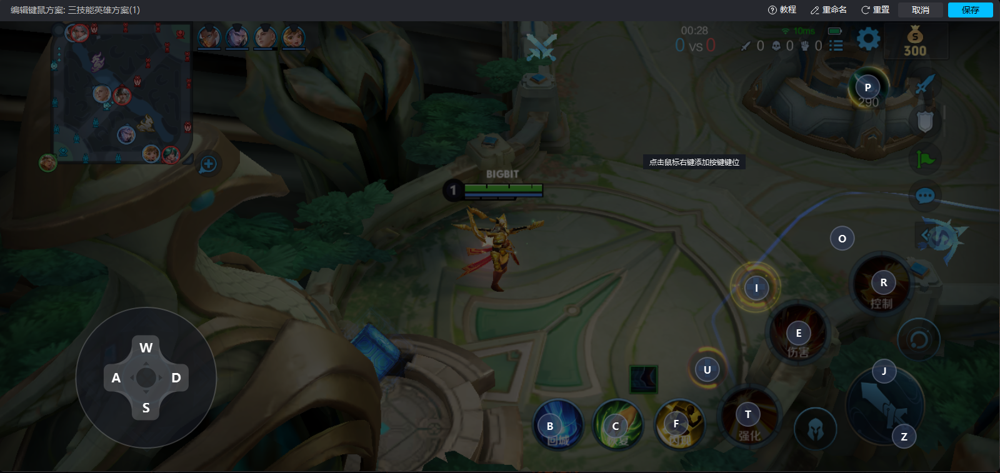

# wzry
学校：华东师范大学

指导教授： 李洋

成员： 南昊天 项豪杰 刘成魁 赵元川

特邀成员：夏伟豪

github仓库地址:https://github.com/qianen6/RL-train-wzry

### 1.环境配置

#### 1.1 代码环境配置

（推荐使用 anaconda 创建 python 版本为 3.12 的虚拟环境，便于之后资源管理）

本项目使用 pip 作为环境部署工具，在本项目的根目录下输入如下指令。

    pip install -r requirements.txt

这会下载本项目在代码层面上的所有第三方依赖。随后需要下载 PyTorch 和 CUDA，输入如下指令。

    pip3 install torch torchvision torchaudio --index-url https://download.pytorch.org/whl/cu118

接下来需要安装用于 GPU 推理的 onnxruntime-gpu。
如果 CUDA 的版本是 11 则输入如下指令进行安装。

    pip install onnxruntime-gpu

如果 CUDA 的版本是 12 则输入如下指令进行安装。

    pip install onnxruntime-gpu --extra-index-url https://aiinfra.pkgs.visualstudio.com/PublicPackages/_packaging/onnxruntime-cuda-12/pypi/simple/

#### 1.2 模拟器环境配置

首先安装模拟器（模拟器推荐使用 mumu 模拟器，安装包放在该项目的 assets/app_tools/mumu 目录下，可以直接使用），接下来我们需要启动模拟器，并将窗口命名为 wzry_ai，分辨率设置为 1600*720，同时确保屏幕缩放率为 100%。项目启动后程序会自动搜寻名字为 wzry_ai 的窗口并从中获取数据开始训练。

在模拟器中安装王者荣耀程序，并进行键位配置，若使用 mumu 模拟器，可采用该方案（分享《王者荣耀》按键操作方案，复制此分享码：

    mumu0364377751

，打开 MuMu 模拟器，在方案管理中导入使用！方案适用分辨率：1600*720）

若为其他模拟器，可参考下图：

同时，我们要修改王者荣耀内部布局，总布局为右手模式，局内出装位置为右侧

轮盘侧边距与技能侧边距均调整为最低

#### 1.3 第三方工具环境配置

##### 1.3.1 OCR 配置

因为项目中使用了 OCR 来识别图片中的相关字符数字，因此，要在本机配置 OCR 工具。

OCR工具已存放在该项目下的 assets/app_tools/Tesseract-OCR 目录下，需要将该目录的绝对路径添加到系统的环境变量中

### 2 目录介绍

#### 2.1 assets
assets目录下存放相关的资源文件，其中app_tools目录下存放相关工具，不要删除。

#### 2.2 wzry_entire
wzry_entire 目录下存放着采集数据，训练数据一体化的程序。暂时已停止维护。

#### 2.3 wzry_online
wzry_online目录下存放采集数据，训练数据分离的程序，两者通过flask框架进行经验数据传输，暂时已停止维护。

#### 2.4 wzry_offline
wzry_offline目录下存放采集数据，训练数据分离的程序，采集数据的程序可将经验数据文件存储为pth格式文件，用于训练程序使用。仍在维护。

各目录具体信息，可参考各目录下的readme文件。
